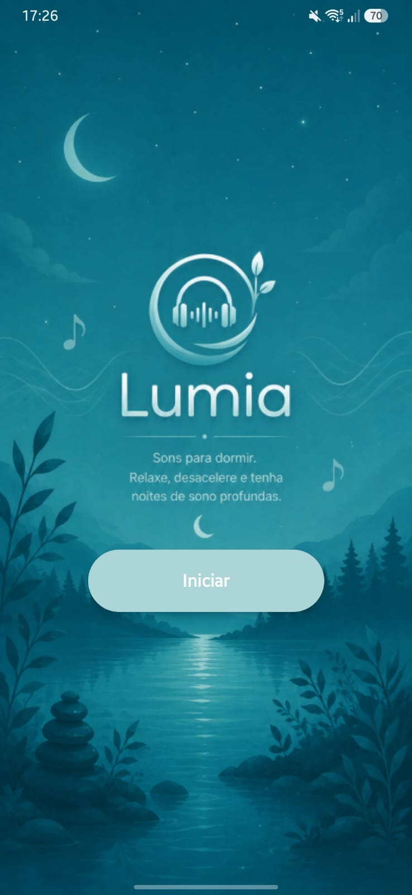
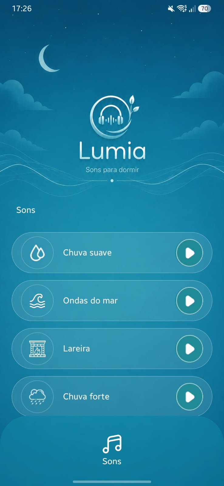
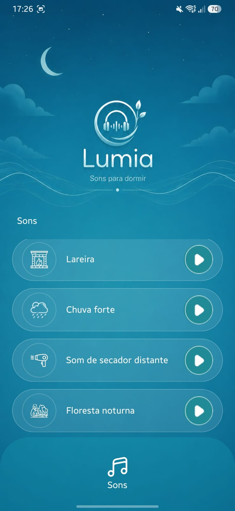
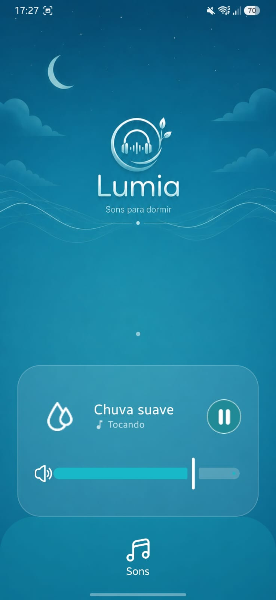

# 🎵 Lumia

Aplicativo desenvolvido em **Kotlin** utilizando **Android Studio** e **Jetpack Compose** como atividade acadêmica.

## 📖 Sobre o projeto

O **Lumia** é um aplicativo de sons relaxantes desenvolvido com o objetivo de proporcionar uma experiência simples e intuitiva para reproduzir sons que auxiliam no relaxamento e no sono.

O projeto utiliza os recursos nativos de áudio do Android para reproduzir diferentes sons e uma interface moderna criada com **Jetpack Compose**.

## 🎯 Objetivo da atividade

Desenvolver um aplicativo Android que demonstre:

* Construção de interfaces utilizando **Jetpack Compose**;
* Utilização de componentes interativos, como botões e controles de reprodução;
* Integração com a API de áudio do Android;
* Reprodução e controle de sons.

## 🚀 Tecnologias utilizadas

* Kotlin
* Android Studio
* Jetpack Compose
* Material Design 3
* API de Áudio do Android

## 📱 Funcionalidades

* Reprodução de sons relaxantes;
* Interface simples e intuitiva;
* Controle de reprodução dos áudios;
* Design desenvolvido para proporcionar uma boa experiência de uso.

## 📂 Estrutura do projeto

```text
app/
 ├── ui/
 ├── screens/
 ├── components/
 ├── audio/
 └── res/
```

## 🎓 Finalidade

Este projeto foi desenvolvido exclusivamente para fins acadêmicos, como atividade da disciplina de Desenvolvimento Mobile.

## 📸 Demonstração

<p align="center">
  
  
  
  
</p>

## 👨‍💻 Autor

Desenvolvido por **Ana Carolina Vieira**.
